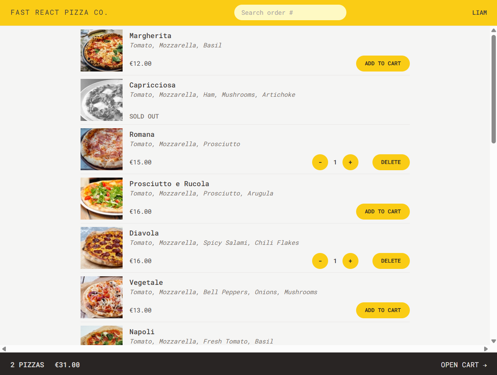

# Fast React Pizza Co.

A pizza ordering app

## Description

This repository contains a simple pizza ordering application built for a fictional company, based on the client's specifications. The app allows users to browse a dynamic pizza menu (loaded from an API), add multiple pizzas to a cart, and place an order without needing an account or login. Before ordering, users simply provide their name, phone number, address, and optionally their GPS location to assist with delivery. A “priority” option can be selected at checkout—or even after the order is placed—for an additional 20% charge. Orders are submitted via a POST request to the API, which returns a unique order ID for tracking. Payment is made upon delivery, so no payment handling is built into the app.

## Usage

To order a pizza, enter your name, choose the pizza(s) you want to order, adding them to a basket. Once done, go to view cart, and order.  This will generate an order number that you can use to keep track of you order. 

## Features
No Account Required: Just input your name and you’re ready to order. No need to remember another password!

Dynamic Menu: Our pizza menu is loaded from an API, ensuring you always have the latest options at your fingertips.

Easy Ordering: Add multiple pizzas to your cart and place your order with just your name, phone number, and address. If possible, provide your GPS location for easier delivery.

Priority Orders: In a hurry? Mark your order as “priority” for an additional 20% of the cart price and we’ll get your pizza to you as fast as possible.

Post-Order Modifications: Changed your mind? You can mark your order as “priority” even after it has been placed.

Payment on Delivery: No need to enter credit card information. Just pay when your pizza arrives.

Unique Order ID: Every order gets a unique ID, so you can easily look up your order later.

# Technologies used
React.js
Routing: React Router
Styling: TailwindCSS
Persist Remote State Management: React Router
UI State Management: Redux Toolkit

## Screenshot

## The website

This site can be found at https://deluxe-nasturtium-b276f5.netlify.app/

## Acknowledgement

This site was built as part of the Ultimate React Course by Jonas Schmedtmann.

## License

MIT License (Please refer to [LICENSE](/LICENSE) in the repo.)

